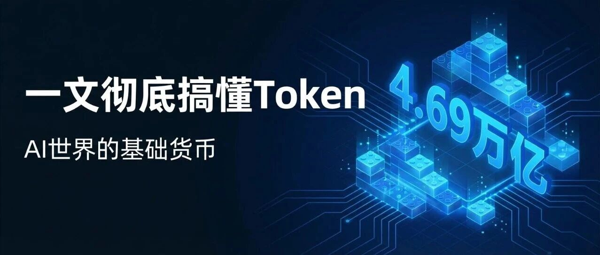
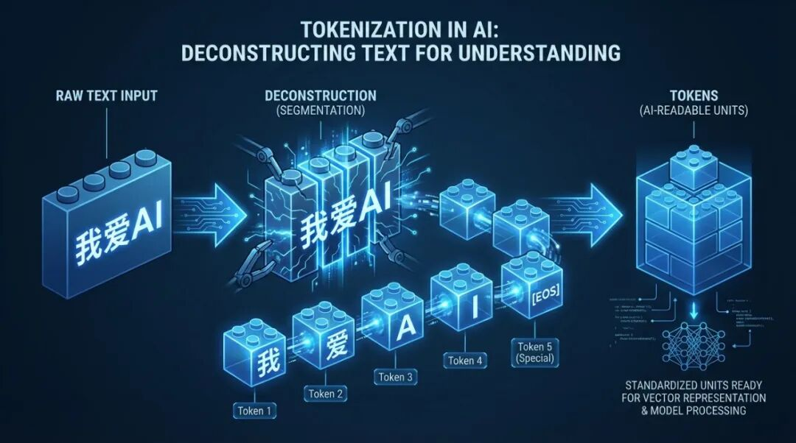
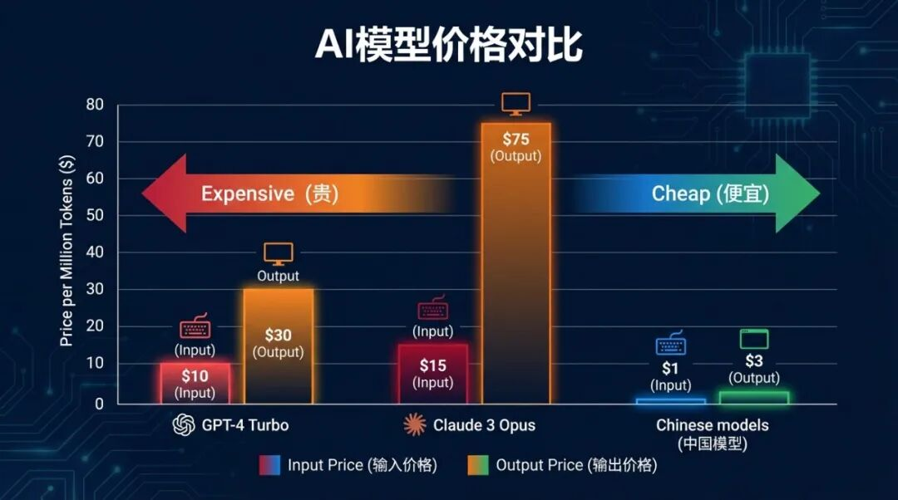

# 一文彻底搞懂Token：AI世界的"基础货币"
来源：美杜莎算法之瞳
作者：美杜莎算法之瞳
发布时间：2026/03/26 12:12:23
原文链接：https://mp.weixin.qq.com/s/z-MmH-rccoy7fA-hMr3PnQ

中国AI周调用量已达4.69万亿Token，超越美国。Token是什么？为什么AI按Token收费？国产大模型为什么能做到十分之一价格？

## 一、一个数字背后的AI战争

2026年3月，一个数字刷屏：**4.69万亿**。

这是中国AI大模型的周Token调用量，来自全球最大AI模型聚合平台OpenRouter。连续第二周，中国超越美国。全球调用量前三的模型，全部来自中国。

Token调用量，就像互联网时代的"日活"，是衡量AI模型真实价值的硬指标。调用量越高，模型被用得越多，创造的价值越大。

而Token，正是这场战争中最基础的计量单位。

## 二、Token是什么？不是单词，是"乐高积木"

很多人第一次听到Token，以为是加密货币。错！

在AI世界里，**Token是大语言模型处理文本的最小单位**。

但Token不等于"单词"或"字符"。它更像一种"压缩后的文字块"——模型把文字切分成小块，每块就是一个Token。

### 举个栗子

英文："I love AI"

- • 人眼：3个单词
- • 模型：3-4个Token

中文："我爱AI"

- • 人眼：3个字
- • 模型：4-6个Token

不同语言"分词逻辑"不同。中文比英文"贵"——平均1.5个汉字 ≈ 1个Token，英文0.75个单词 ≈ 1个Token。

**Token就是AI阅读写作时的"乐高积木"，每块承载一小块语义。**

## 三、为什么按Token收费？

用过ChatGPT、Kimi、通义千问都知道，AI服务要么按月订阅，要么按Token付费。

为什么？

**Token = 算力消耗**

每次对话，模型都在进行海量计算：

- • 输入：文字切成Token，转换成向量
- • 处理：每个Token在神经网络中流动，消耗算力
- • 输出：一个Token一个Token生成回复

Token越多，计算量越大，GPU算力和电费就越多。

### 收费对比

| 模型 | 输入（每百万Token） | 输出（每百万Token） |
| --- | --- | --- |
| GPT-4 Turbo | $10 | $30 |
| Claude 3 Opus | $15 | $75 |
| 国产模型 | 约$1 | 约$3 |

差距明显。**国产模型价格只有海外的十分之一。**

## 四、Token怎么算？分词器的"切菜"过程

模型怎么知道该把文字切成多少块？

这个过程叫**分词（Tokenization）**，由"分词器"完成。

### 比喻：切菜

厨师把黄瓜切成小块：

- • 有人切成薄片（Token多）
- • 有人切成大块（Token少）
- • 切法不同，但都是"黄瓜块"

AI分词器也有一套预设"切法"，把文字切成最有语义价值的"块"。

### 实例

在ChatGPT或Kimi输入："今天天气真好，我想去公园散步。"

模型会告诉你：这句话约15-20个Token（取决于具体模型）。

### Token计数工具

- • OpenAI Tokenizer：官方工具，在线查看
- • Kimi Token计数：国产模型自带
- • 各模型API文档：通常有计算说明

## 五、中国AI为什么便宜？

十分之一价格，不是亏本赚吆喝，是真实成本优势。

### 1. 电费优势

AI模型的"燃料"是电。训练和推理都需要GPU日夜运转。

- • 中国工业电价：约0.6-0.8元/度
- • 美国工业电价：约0.12-0.15美元/度（折合0.85-1.1元/度）

电费差，直接决定算力成本差。**电费占成本70%-80%。**

### 2. 技术创新

国产模型做了大量架构优化：

- • 更高效的推理链条
- • 可解释性设计
- • 模型压缩技术

### 3. 开源生态

DeepSeek、Qwen、ChatGLM等开源模型，让企业可以"站在巨人肩膀上"，省去巨额训练成本。

### 结果：正向循环

技术迭代 → 成本下降 → 应用爆发 → 更多数据 → 技术再迭代

这就是中国AI的"价格护城河"。

## 六、普通人怎么利用Token经济？

理解Token，能省钱，也能赚钱。

### 省钱技巧

和AI对话时：

- • ❌ "我想请你帮我写一篇关于人工智能发展历史的文章，大概1000字左右"
- • ✅ "写一篇AI发展史，1000字"

同样需求，更少Token，更低成本。

### 选模型

- • 简单问答：选便宜的模型（GPT-3.5、国产轻量版）
- • 复杂推理：选强大的模型（GPT-4、Claude）

别"杀鸡用牛刀"，Token有成本。

### 未来机会

- • Token交易市场：可能出现的Token期货
- • 企业AI成本优化：懂Token的人能帮企业省大钱
- • Token审计师：新职业

## 结语

互联网时代，流量是核心。AI时代，Token是核心。

下次看到"4.69万亿Token"，你不会再懵——那是中国AI的"日活"，是无数企业和用户用脚投票的结果。

这场Token战争，才刚刚开始。

**关注我，用通俗语言讲透AI。**
