# OpenAI 发布 Workspace Agents，接替 GPTs
来源：赛博禅心
作者：金色传说大聪明
发布时间：2026/04/23 08:46:32
原文链接：https://mp.weixin.qq.com/s/x-4v6WAZmohanfXluz8TIw
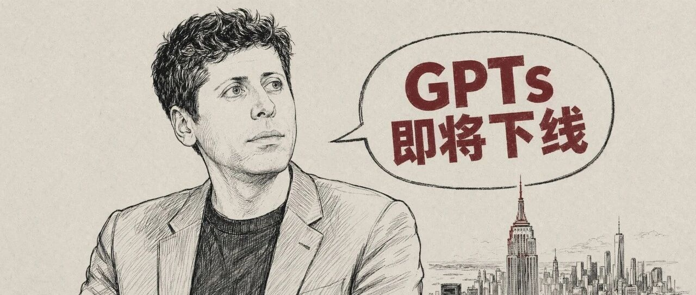
PRODUCT

---

今天凌晨，OpenAI 发布了 **Workspace Agents**，基于 Codex 的团队级工作空间 Agent

这个东西，就是 21 号被 TestingCatalog 爆出的 `Hermes` 代号产品，面向企业市场，对 ChatGPT Business、Enterprise、Edu、Teachers 这四个套餐对订阅用户开放

官方入口：`openai.com/index/introducing-workspace-agents-in-chatgpt`

[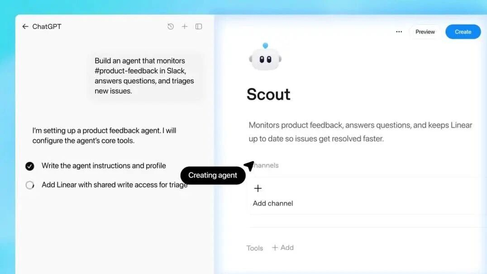](https://mp.weixin.qq.com/mp/readtemplate?t=pages/video_player_tmpl&action=mpvideo&auto=0&vid=wxv_4484746604419334145)

Build a new agent，描述一句话，ChatGPT 帮你搭 Agent

OpenAI 给 Workspace Agents 的定位是 `an evolution of GPTs`，GPTs 的进化形态

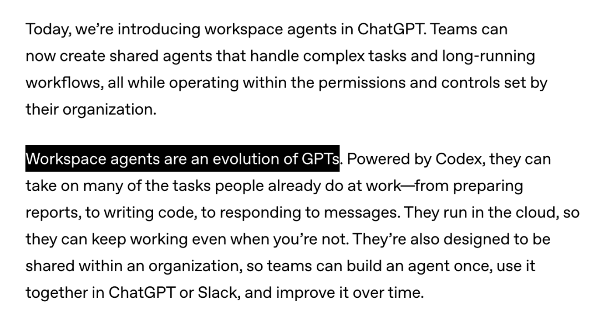

同一段话里顺手写了 GPTs 的结局：**过段时间会提供一键转换到 workspace agents 的通道**

翻成人话就是：木的了

---

## 是什么

Workspace Agents 其实就是团队形态的 Agent

一个人把团队里反复做的工作流描述给 ChatGPT，ChatGPT 就会给搭成一个 Agent，然后整个团队可以在 ChatGPT 或 Slack 里用这个 Agent，一边用一边改，越用越准

对比于之前的产品的，大概是这样：

**GPTs（2023 年 11 月）**

prompt + 知识库 + Actions，一次性配置，单人使用为主，没有真正的长流程执行能力

**ChatGPT Agent（2025 年 7 月）**

单用户、一次性的任务执行，完成即走，没有持久身份

**Workspace Agents（2026 年 4 月）**

团队共享，持久运行，有记忆，按流程工作，带治理

---

## 五个官方案例

OpenAI 拿出来做 demo 的五个案例，没有一个是写代码的：

### Software Reviewer，软件请求分流 Agent

审查员工发起的软件采购请求，对照白名单和政策，推荐下一步，必要时直接开 IT ticket

[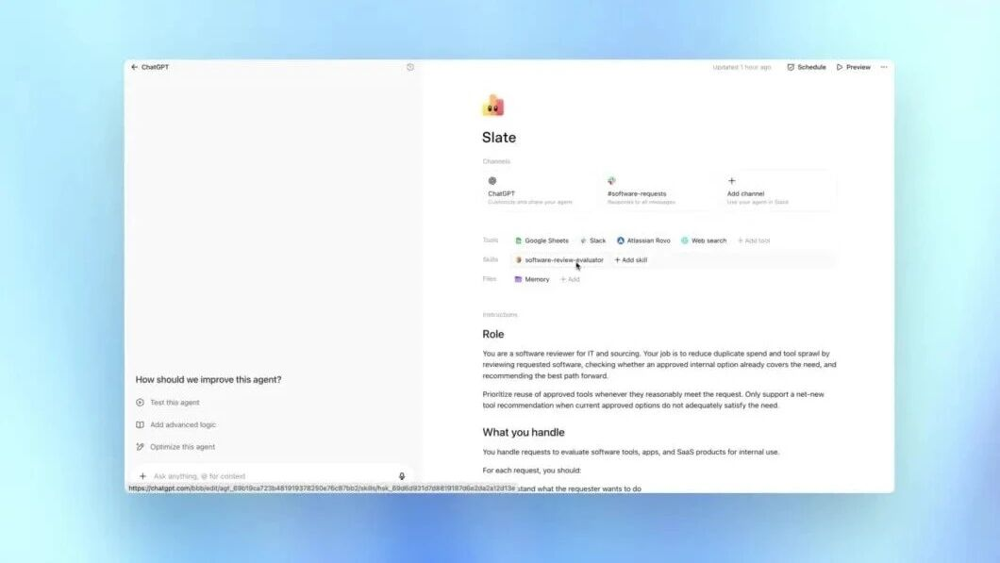](https://mp.weixin.qq.com/mp/readtemplate?t=pages/video_player_tmpl&action=mpvideo&auto=0&vid=wxv_4484742789599281155)

Slack 频道里员工发软件采购请求，Agent 逐条回应

### Product Feedback Router，产品反馈路由 Agent

监听 Slack、工单系统、公开渠道的反馈，分类、打优先级，转成 ticket，每周生成一份产品反馈小结

[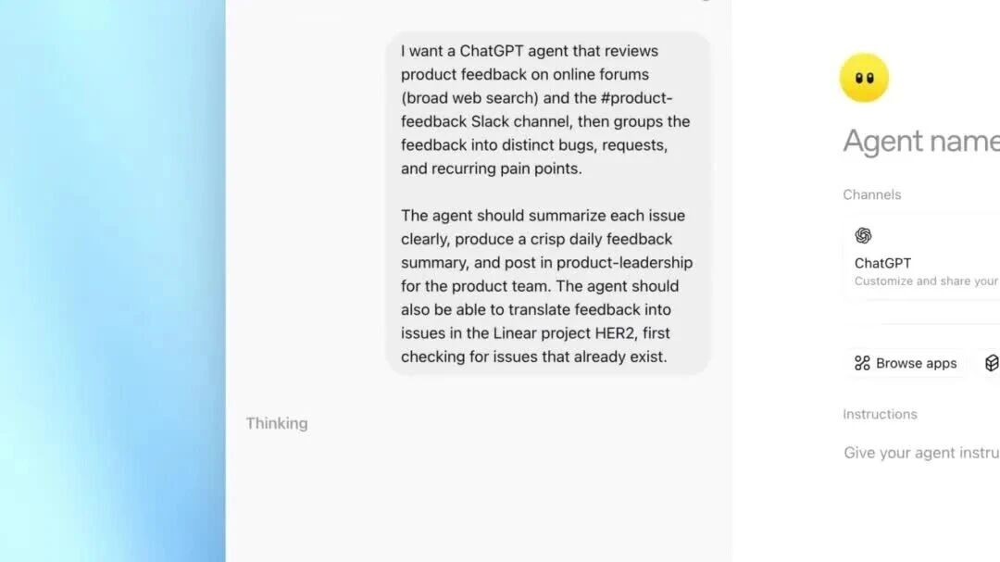](https://mp.weixin.qq.com/mp/readtemplate?t=pages/video_player_tmpl&action=mpvideo&auto=0&vid=wxv_4484743690468556801)

Scout 反馈路由 agent 的配置面板，挂上 Slack 和 Linear MCP

### Weekly Metrics Reporter，周报 Agent

每周五自动拉数据、画图、写叙述段落，把周报交到团队手上

[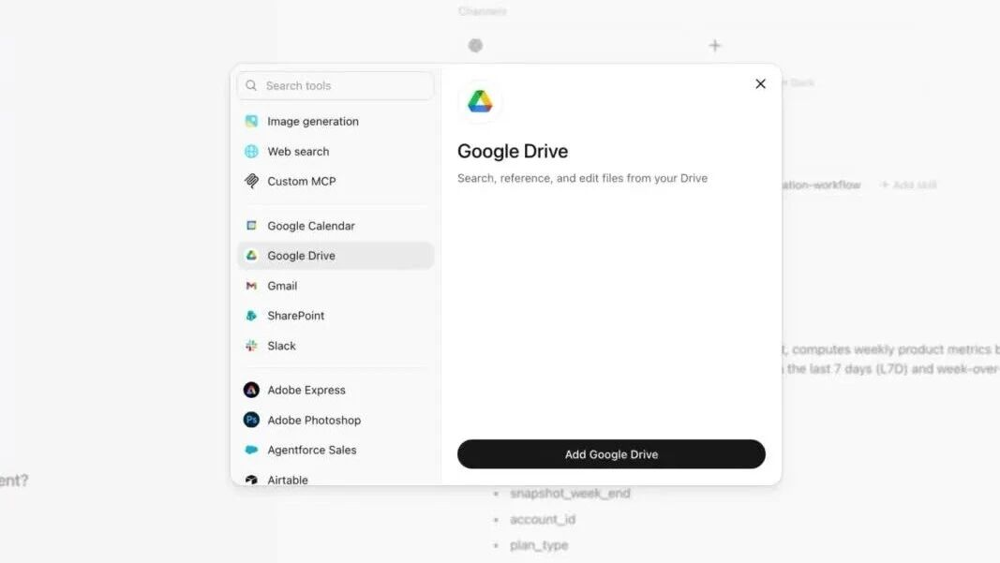](https://mp.weixin.qq.com/mp/readtemplate?t=pages/video_player_tmpl&action=mpvideo&auto=0&vid=wxv_4484742664005091338)

Tally 周报 agent，挂 Google Drive 和多个分析 skill

### Lead Outreach Agent，销售线索 Agent

对入站线索做背调、按团队的打分规则评级、起草个性化跟进邮件、更新 CRM

[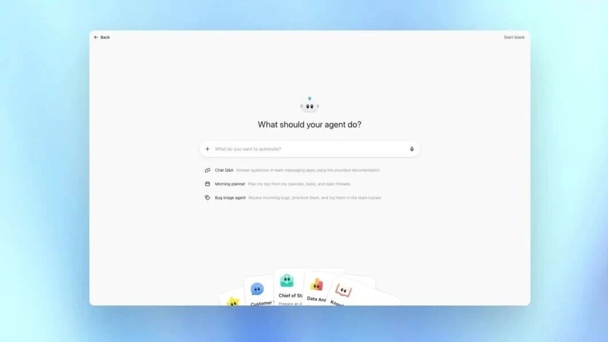](https://mp.weixin.qq.com/mp/readtemplate?t=pages/video_player_tmpl&action=mpvideo&auto=0&vid=wxv_4484742838907322369)

Spark 销售外联 agent，挂 Gmail、Google Calendar 和 web search

### Third-Party Risk Manager，第三方风控 Agent

对供应商做制裁名单、财务健康、舆情风险的筛查，出结构化报告

[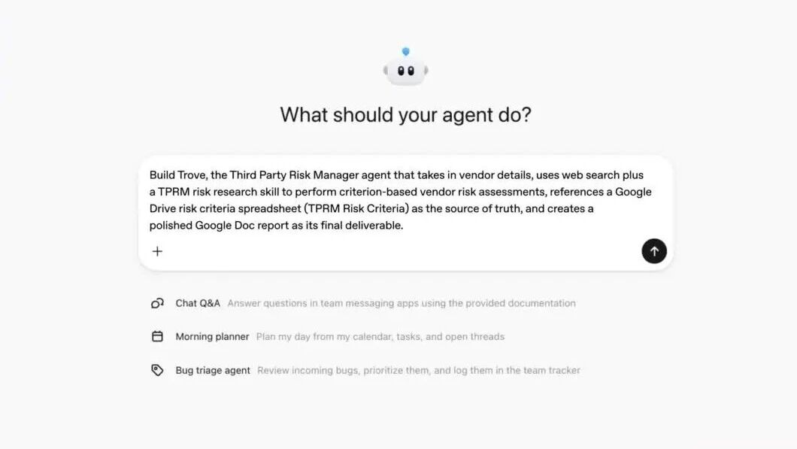](https://mp.weixin.qq.com/mp/readtemplate?t=pages/video_player_tmpl&action=mpvideo&auto=0&vid=wxv_4484742718983880710)

Trove 风控 agent，挂 Google Drive、Docs 和自定义 TPRM skill

这五个案例覆盖 IT、产品、财务、销售、风控五个职能，每一个在企业里都是重复性高、SOP 明确、数据分散在多个系统的活

此外，OpenAI 另外还放了 finance、sales、marketing 等方向的预置模板库，搭 Agent 不用从零开始

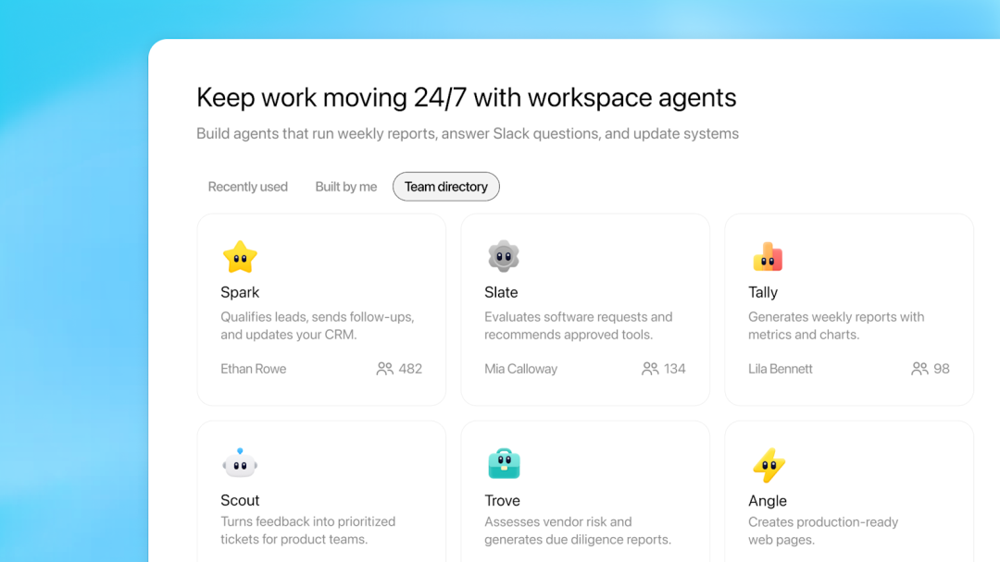

团队目录里同事搭好的 agent，一屏看完直接复用

大概就是：描述你要做的事，或者直接丢一份文档给 ChatGPT，它自己把步骤拆开、把需要的工具接上、把 skills 加进去，搭完拉你一起测

---

## Codex，业务 Agent 的运行时

Workspace Agents 底下跑的是 Codex。每个 Agent 有一个云端工作空间，里头有文件系统、代码执行环境、连接的 app、记忆

这套东西提供的能力：

- 写代码、跑代码

- 调用连接的 app（Gmail、GitHub、Google Drive、Slack 等，走 ChatGPT Connectors）

- 记住之前学到的东西

- 跨多步持续执行，不用每一步都被唤醒

Codex 过去一年一直在扩地盘，从 Codex CLI 到 IDE extension，到 macOS app、Windows app，到 4 月 16 日的 `Codex for (almost) everything`

到了今天，Workspace Agents 把 Codex 抬进 ChatGPT 主界面，给到销售、财务、IT、市场这些部门用

OpenAI 举了个内部例子：产品团队做了个 Agent 蹲在 Slack 频道里，员工问问题它就回答，附上文档链接，发现新 bug 直接开 ticket

---

## 部署：ChatGPT 和 Slack

Workspace Agents 目前两个部署的方法：

- ChatGPT 里跟它对话

- Slack 里把它拉进频道

Slack 里的 Agent 能跟着对话上下文回消息、处理请求、推进工作流

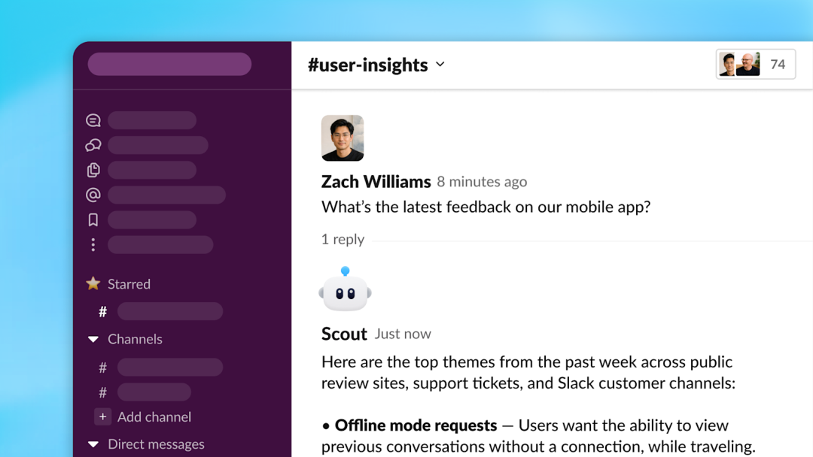

Slack 里的 Sola 反馈路由 agent，直接在频道里回同事的问题

在 OpenAI 内部，销售团队有一个 Agent，把通话记录和账户调研拼起来、给线索打分、在销售代表邮箱里直接写跟进邮件草稿。财务团队有一个 Agent 做月结，准备分录、做资产负债表对账、跑差异分析，几分钟完成，附带底稿供复核，走内部合规流程

OpenAI 说 **更多部署饭搞法很快跟上**。这句话里的潜台词，是 Anthropic 在 3 月把 Claude Cowork 推到 macOS 和 Windows，Dispatch 把手机变成远程遥控器

很显然，OpenAI 的生态方面目前比 Anthropic 要弱一点，但明显在加速

---

## 控制与治理

团队级 Agent 想要搞好，需要解决的是谁能用它、它能动什么、它走到哪一步要停下来问一下

Workspace Agents 的控制分四层：

**工具与数据访问**每个 Agent 能用哪些工具、能访问哪些数据，搭的时候就定好

**敏感操作 approval**编辑表格、发邮件、加日历事件这种，可以设置必须先征得用户同意

**admin RBAC**Enterprise 和 Edu 管理员控制谁能用、谁能搭、谁能共享；控制哪些 connected tools 开给哪些 user group

**Prompt injection 防护**Agent 遇到外部内容里的对抗指令时，有内置护栏约束它别偏航

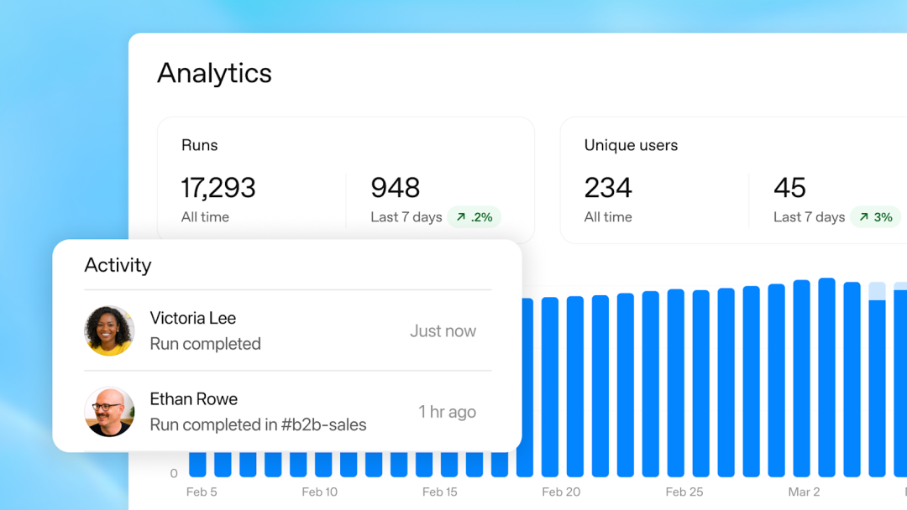

Agent 上线后的使用分析：总运行次数、活跃用户、运行趋势

Agent 发布出去之后，搭的人能看到运行次数、使用人数、活跃情况。对管理员开放的是 `Compliance API`，能看到每个 Agent 的配置、更新记录、每次运行；需要时能直接挂起 Agent。OpenAI 预告后面会在 admin console 里加一个全局视图，整个组织用了哪些 Agent、调了哪些数据源，一屏看完

---

## Rippling 的安利

OpenAI 请的早期客户是 Rippling。Rippling 的 AI Engineering 负责人 Ankur Bhatt 说的话，放到这里原意是：

搭 Agent 的难点从来不是模型，是集成、记忆、交互体验这些脚手架。Workspace Agents 把脚手架部分包掉之后，他们家一个 Sales Consultant 自己搭完了一个 Sales Opportunity Agent，没有工程团队介入。这个 Agent 做的事是研究账户、摘要 Gong 电话记录、把 deal brief 直接发到销售团队 Slack 频道里。过去销售代表每周要花 5-6 个小时做的事，现在在每一笔 deal 背后常驻跑。

Ankur Bhatt，Rippling AI Engineering

一个非工程岗位的销售顾问，独立搭出一个给整个销售团队共用的 Agent，然后这个 Agent 再服务其他同事

销售搭 Agent 给销售用，不需要技术参与

---

## 定价与下一步

研究预览期，到 2026 年 5 月 6 日之前，workspace agents 免费。5 月 6 日之后开始走 **credit-based pricing**

同一天 OpenAI 给 Enterprise plan 铺了 flexible pricing 的 credit pool，workspace agents 从这个池子里扣量。企业的 AI 支出模型，从 `买多少个席位` 切换到 `跑了多少 token`

OpenAI 给出的下一步路线：

**Triggers**Agent 可以被事件自动启动，不只是被时间表启动

**更好的 dashboard**搭完 Agent 之后，搭建者能看到怎么优化它

**更多业务工具 actions**Agent 能在更多 SaaS 里执行动作

**Codex app 支持**workspace agents 进入 Codex 桌面应用

GPTs 发布在 2023 年 11 月 6 日的首届 DevDay 上，到今天是 900 天。900 天里 OpenAI 试过 GPT Store、试过 GPT Actions、试过让 GPTs 在 ChatGPT 里变成主要入口，但很显然，都 G 了

小声说一下：

GPTs 发布之初，用量前 100 的 GPTs 中，有两个是我捏的

而现在，OpenAI 最后给它准备的结局是换个形态继续活，换成 workspace agents

还有就是，这个东西在 5 月 6 日前免费，之后是跑多少算多少。企业的评估从 `给多少人开通` 切换到 `跑出来多少业务产出 vs 烧了多少 token`

这个变化，或是接下来一年企业 AI 采购故事的主线

---

参考材料

Introducing workspace agents in ChatGPT，OpenAI 官方博客

`openai.com/index/introducing-workspace-agents-in-chatgpt`

ChatGPT Business

`chatgpt.com/business`
